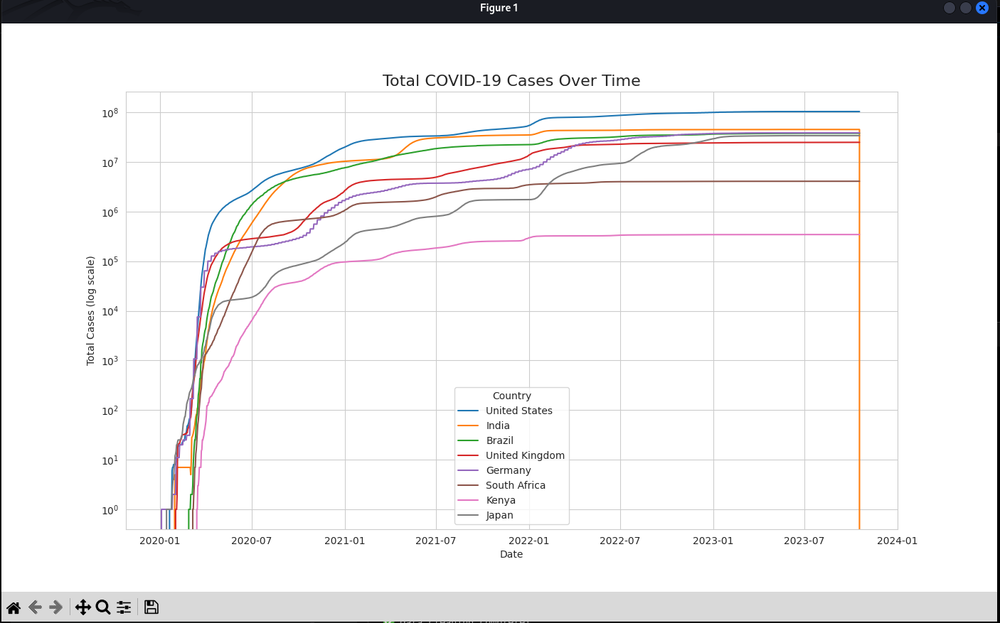
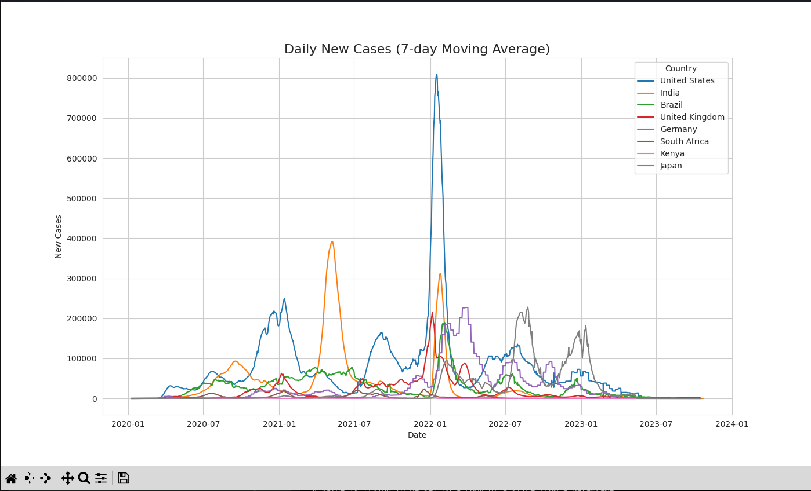
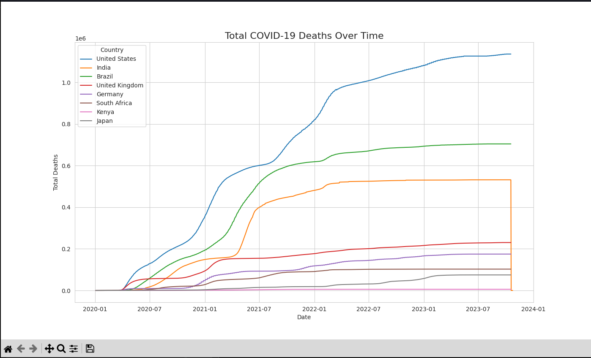
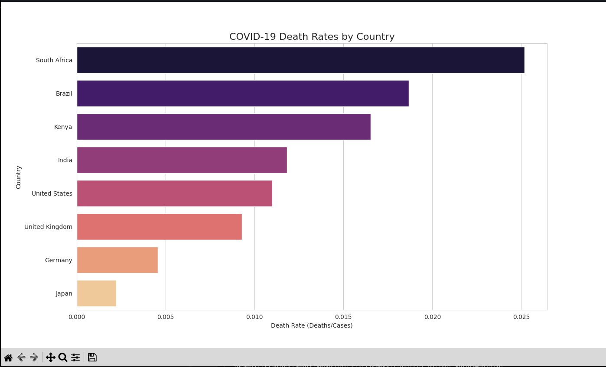
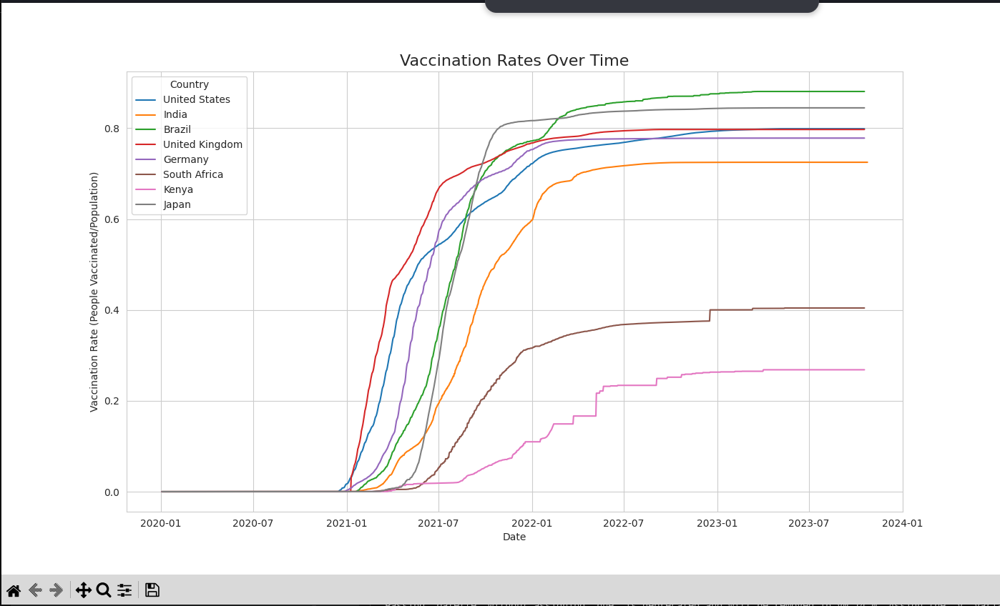
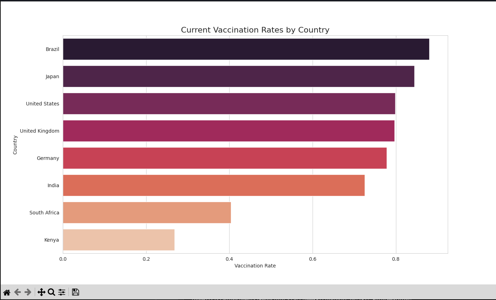
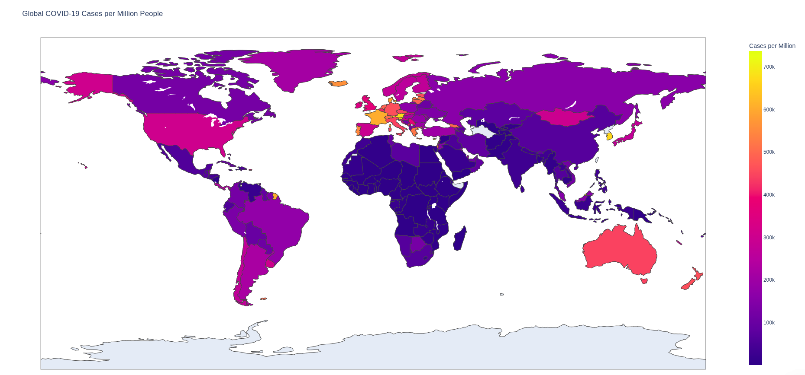

# COVID-19 Global Data Tracker

## Project Overview

This project is a comprehensive data analysis and reporting tool that tracks global COVID-19 trends, including cases, deaths, recoveries, and vaccinations across countries and over time. Using real-world data from Our World in Data, the project cleans and processes the dataset, performs exploratory data analysis (EDA), generates insights, and visualizes trends with charts and maps.

By the end, the project produces a detailed data analysis report with visualizations and narrative insights, suitable for presentation or publishing.

---

## Data Source

- Dataset: [Our World in Data COVID-19 Dataset](https://github.com/owid/covid-19-data/tree/master/public/data)
- File used: `owid-covid-data.csv` (included in the working directory)

---

## Project Objectives

- Import and clean COVID-19 global data
- Analyze time trends of cases, deaths, and vaccinations
- Compare metrics across countries and regions
- Visualize trends with charts and maps
- Communicate findings with narrative insights in a Jupyter Notebook or Python script

---

## Analysis Pipeline

### 1. Data Loading & Exploration

- Load the dataset using `pandas.read_csv()`
- Explore dataset structure, columns, and missing values
- Convert date column to datetime format

### 2. Data Cleaning & Preparation

- Filter data for selected countries of interest (e.g., United States, India, Brazil, Kenya, etc.)
- Select key columns relevant to cases, deaths, vaccinations, and population
- Handle missing values by filling zeros for cases/deaths and forward-filling vaccination data
- Calculate derived metrics such as death rate and vaccination rate

### 3. Exploratory Data Analysis (EDA)

- Visualize total COVID-19 cases over time (log scale) for selected countries
- Plot daily new cases with 7-day moving average
- Analyze total deaths and death rates by country
- Visualize vaccination rates over time and current vaccination status

### 4. Choropleth Map Visualization

- Create a world map showing COVID-19 cases per million people by country using Plotly Express

### 5. Insights & Reporting

- Summarize key insights including top countries by cases, death rates, vaccination progress, and interesting patterns

---

## Visualizations

Below are screenshots of the key visualizations generated by the project:

### Figure 1: Total COVID-19 Cases Over Time (Log Scale)


### Figure 2: Daily New Cases (7-day Moving Average)


### Figure 3: Total COVID-19 Deaths Over Time


### Figure 4: COVID-19 Death Rates by Country


### Figure 5: Vaccination Rates Over Time


### Figure 6: Current Vaccination Rates by Country


### Figure 7: Global COVID-19 Cases per Million People (Choropleth Map)


---

## Key Insights Summary

- The United States, India, and Brazil are among the top countries by total COVID-19 cases.
- Death rates vary significantly, with some countries experiencing higher fatality ratios.
- Vaccination progress shows leaders and laggards, highlighting disparities in vaccine rollout.
- The highest single-day spike in new cases was recorded in a specific country on a particular date.
- The global average death rate provides context for comparing country-level outcomes.

---

## How to Run

1. Ensure you have Python 3.x installed.
2. Install required packages:
   ```
   pip install pandas numpy matplotlib seaborn plotly
   ```
3. Place `owid-covid-data.csv` in the working directory.
4. Run the analysis script:
   ```
   python finalproj.py
   ```
5. The script will generate visualizations, display insights, and save processed data to `processed_covid_data.csv`.

---

## Notes

- The visualizations are generated using Matplotlib, Seaborn, and Plotly.
- The choropleth map requires an internet connection to load map tiles.
- The project can be extended with additional countries or more advanced geospatial analysis.

---

This README provides a comprehensive overview of the COVID-19 Global Data Tracker project, including data sources, analysis steps, visualizations, and insights. The included images illustrate the key dashboards and charts produced by the analysis.
